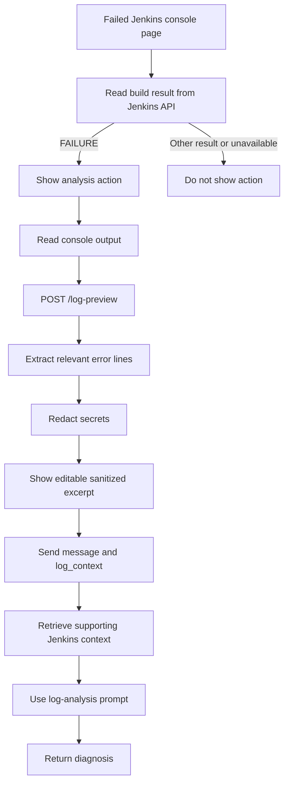

# Jenkins Build Failure Diagnosis

## 1. What It Is

### Overview

The build failure diagnosis flow helps a user investigate a failed Jenkins build from its console page. The frontend detects a completed build with the `FAILURE` result, offers an analysis action, and reads the console output from the page.

Before the log reaches the chatbot, the backend extracts the error sections most likely to explain the failure and redacts common secrets. The user can review or edit the prepared excerpt before sending it. The final request carries the excerpt in `log_context`, so the diagnosis prompt can prioritize the build output over unrelated retrieved documentation.

The preview endpoint is defined in [`chatbot-core/api/routes/chatbot.py`](../../chatbot-core/api/routes/chatbot.py). Log extraction and sanitization are implemented in [`chatbot-core/api/services/chat_service.py`](../../chatbot-core/api/services/chat_service.py), [`chatbot-core/api/tools/log_parser.py`](../../chatbot-core/api/tools/log_parser.py), and [`chatbot-core/api/tools/sanitizer.py`](../../chatbot-core/api/tools/sanitizer.py).

### Why It Is Useful

Jenkins console output can be long and may contain secrets or unrelated setup output. Sending the complete log to a model is noisy and can expose values that should not leave the browser.

The diagnosis flow keeps the investigation focused on the relevant failure lines, preserves nearby context, and removes common credentials before the excerpt is displayed or used for generation.

### When It Is Available

The analysis action is available when all of the following are true:

- the user is on a Jenkins console page
- the build result returned by the Jenkins API is `FAILURE`

The frontend waits briefly before showing a toast when the chatbot is closed. When the chatbot is open, the inline action appears only while the message input is empty. If the Jenkins status request fails, or the page is not a console page, the action is not shown.

---

## 2. How to Use It

1. Open a failed Jenkins build's Console Output page.
2. Open the chatbot after the build result is available.
3. Select the build-failure analysis action.
4. Review the prepared sanitized log excerpt in the message composer.
5. Edit the excerpt or add a question when needed.
6. Send the message to receive a diagnosis grounded in the selected error lines.

The same API also supports a programmatic log-only request by providing `log_context` with an empty `message`.

---

## 3. How It Runs

### Build Failure Flow



### Log Preview Endpoint

The frontend calls:

```text
POST /api/chatbot/log-preview
```

Request body:

```json
{
  "log_text": "Raw Jenkins console output"
}
```

Response body:

```json
{
  "preview": "Sanitized relevant log excerpt"
}
```

The endpoint does not invoke the LLM. It prepares a preview only, allowing the user to inspect the sanitized excerpt before analysis.

### Diagnosis Request

The normal message endpoint accepts an optional `log_context` field:

```json
{
  "message": "Analyze the provided failed Jenkins build logs.",
  "log_context": "Sanitized relevant log excerpt"
}
```

`message` may be empty when `log_context` is present. In that case, the backend supplies the default build-analysis request message.

---

## 4. Log Preparation and Safety

### Relevant Log Lines

[`extract_relevant_log_lines()`](../../chatbot-core/api/tools/log_parser.py) searches for Jenkins error anchors, including `ERROR`, `FATAL`, `BUILD FAILURE`, and `Finished: FAILURE`.

For each error it keeps nearby lines before and after the match. If no error anchor is found, it returns the final lines of the console output. Jenkins wrapper failures such as `script returned exit code` are used as a fallback, and the final failure footer is retained when it follows the selected error section.

### Secret Redaction

[`sanitize_logs()`](../../chatbot-core/api/tools/sanitizer.py) removes common sensitive values before a preview, prompt, or diagnostic log entry is produced.

| Sensitive content | Handling |
| --- | --- |
| Authorization, API-key, crumb, and cookie headers | Replaced with `[REDACTED]` |
| Secret-like variable assignments | Value replaced while preserving the variable name |
| Docker `login -p` or `--password` values | Password replaced with `[REDACTED]` |
| Passwords embedded in URLs | Password component replaced |
| Access tokens, AWS keys, GitHub tokens, API keys, and JWT-like values | Replaced with a typed redaction marker |
| Private-key blocks, including truncated blocks | Replaced with `[REDACTED_PRIVATE_KEY]` |

Sanitization is applied again before prompts and diagnostic payloads are logged. Editing the displayed excerpt triggers another preview request, so edited log text is redacted before it is sent as `log_context`.

---

## 5. Diagnosis Prompt Behavior

When `log_context` is present, [`build_prompt()`](../../chatbot-core/api/prompts/prompt_builder.py) uses `LOG_ANALYSIS_INSTRUCTION` from [`chatbot-core/api/prompts/prompts.py`](../../chatbot-core/api/prompts/prompts.py).

The instruction tells the model to:

- identify the root cause from the user-provided log data
- cite specific errors, exceptions, or exit codes when available
- use retrieved documentation only when it explains the log failure
- state when the excerpt does not contain a specific error

The service removes an exact duplicate of the attached excerpt from the normal user message before building the prompt. It adds the sanitized excerpt to the retrieval query, so retrieval can still find documentation relevant to the observed error.

---

## 6. Code Structure

| File | Responsibility |
| --- | --- |
| [`frontend/src/utils/useContextObserver.ts`](../../frontend/src/utils/useContextObserver.ts) | Detects failed Jenkins console pages and schedules the analysis action. |
| [`frontend/src/components/Chatbot.tsx`](../../frontend/src/components/Chatbot.tsx) | Reads console output, displays the prepared excerpt, handles edits, and sends diagnosis requests. |
| [`frontend/src/api/chatbot.ts`](../../frontend/src/api/chatbot.ts) | Calls the log-preview and message endpoints. |
| [`chatbot-core/api/routes/chatbot.py`](../../chatbot-core/api/routes/chatbot.py) | Exposes `/log-preview` and accepts `log_context` on chat requests. |
| [`chatbot-core/api/models/schemas.py`](../../chatbot-core/api/models/schemas.py) | Validates preview and chat request payloads. |
| [`chatbot-core/api/services/chat_service.py`](../../chatbot-core/api/services/chat_service.py) | Prepares log context, builds the retrieval query, and creates the diagnosis prompt. |
| [`chatbot-core/api/tools/log_parser.py`](../../chatbot-core/api/tools/log_parser.py) | Selects error windows and Jenkins failure footer lines. |
| [`chatbot-core/api/tools/sanitizer.py`](../../chatbot-core/api/tools/sanitizer.py) | Redacts secrets from logs and diagnostic payloads. |
| [`chatbot-core/api/prompts/prompts.py`](../../chatbot-core/api/prompts/prompts.py) | Defines the log-analysis instruction. |

---

## 7. Edge Cases Handled

- The analysis action appears only for failed Jenkins console pages and is delayed to avoid accidental repeats.
- Empty logs return no excerpt. Logs without a recognized error return a bounded tail.
- Multiple error windows are merged, and a trailing `Finished: FAILURE` line is retained when relevant.
- Requests need a message or `log_context`; log-only requests use the default analysis message.
- Edited excerpts are previewed and sanitized again before they are sent.

---

## 8. Troubleshooting

### Analysis action does not appear

Check that the page is a Jenkins console page with result `FAILURE`. Wait for the delayed toast, or open the chatbot with an empty composer for the inline action.

### Preview is empty

Check that the console page contains output. An empty preview means the source text was empty or unavailable.

### The excerpt misses the error

The preview contains selected error windows, not the full log. Add the missing lines in the composer and send the edited excerpt.

### The diagnosis misses the cause

Add the failure section containing the relevant error, exception, or exit code and resend it.

---

## 9. Current Boundaries and Future Improvements

The flow currently handles failed Jenkins console pages with text logs and an available build status. It does not yet identify the primary cause when a log contains several independent failures, associate the error with a Pipeline stage or build agent, or link the answer to the console lines used for the diagnosis.

- Rank error sections so the response starts with the likely primary failure instead of treating every selected section equally.
- Include available build metadata, such as the failed Pipeline stage, build number, and agent, in the diagnosis context.
- Preserve line locations or console links so users can verify the error reported by the model.
- Add a diagnosis dataset covering compilation, test, dependency, infrastructure, and authentication failures.
- Measure whether the reported cause is supported by the selected log lines and whether sensitive values remain redacted in the response.
