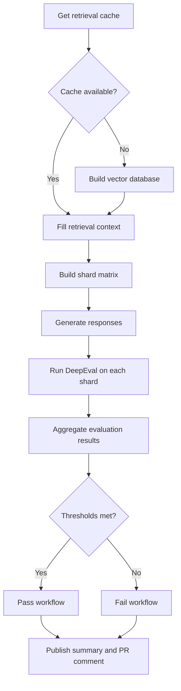

# LLM-as-a-Judge Evaluation Pipeline

## 1. What It Is

### Overview

The LLM-as-a-Judge evaluation pipeline is a GitHub Actions workflow that checks Jenkins chatbot answers using DeepEval. It uses a fixed golden dataset, retrieves Jenkins context for each question, generates answers with a local Ollama model, and scores them with a separate local Ollama judge model.

The main workflow is defined in [`.github/workflows/eval.yml`](../../../.github/workflows/eval.yml). The reusable retrieval-cache workflow is defined in [`.github/workflows/build-retrieval-cache.yml`](../../../.github/workflows/build-retrieval-cache.yml), and the pull request reporting workflow is defined in [`.github/workflows/eval-comment.yml`](../../../.github/workflows/eval-comment.yml).

### Why It Is Useful

Unit and integration tests validate deterministic behavior, but they do not directly measure whether generated answers are relevant and grounded in retrieved context.

It is most useful for catching answer-quality regressions that normal tests miss, especially when a change affects retrieval, prompts, model settings, or the data pipeline.

### When to Run It

Run it for pull requests that can change chatbot answers, especially:

- retrieval logic
- data collection, chunking, embeddings, or vector storage
- chatbot prompts
- response generation settings
- DeepEval metrics, thresholds, templates, or golden data
- Ollama model setup or evaluation workflow behavior

The workflow runs only when the pull request has the `eval` label.

---

## 2. Evaluation Parameters

### Faithfulness

**What it measures:**

Faithfulness checks whether the generated answer is supported by the retrieved Jenkins context. It compares `actual_output` against `retrieval_context`.

**A low score may indicate:**

- the answer includes details that are not in `retrieval_context`
- the answer mixes facts from unrelated Jenkins sources
- the retrieved context is noisy enough that the judge cannot match claims cleanly

Faithfulness uses the custom `JenkinsFaithfulnessTemplate` in [`chatbot-core/tests/eval/faithfulness_template.py`](../../../chatbot-core/tests/eval/faithfulness_template.py) to give DeepEval Jenkins-specific judging instructions.

### Answer Relevancy

**What it measures:**

Answer Relevancy checks whether the generated answer addresses the input question. It compares `actual_output` against the test case input.

**A low score may indicate:**

- the answer does not directly answer the question
- the answer is too generic or incomplete
- the model focused on the wrong retrieved context

### Contextual Recall

**What it measures:**

Contextual Recall checks whether the retrieved context contains the information needed for the expected answer. It compares `retrieval_context` against `expected_output`.

**A low score may indicate:**

- the relevant Jenkins page, plugin page, or community thread was not retrieved
- the cached vector database is stale or incomplete
- the expected answer needs information that is not present in the retrieved chunks

### Evaluation Threshold

The configured metric threshold is `0.85`, from [`chatbot-core/tests/eval/config.json`](../../../chatbot-core/tests/eval/config.json).

All three metrics use this threshold:

- Faithfulness
- Answer Relevancy
- Contextual Recall

The final quality gate is enforced in [`chatbot-core/tests/eval/runners/aggregate_evaluations.py`](../../../chatbot-core/tests/eval/runners/aggregate_evaluations.py). The workflow fails if any metric average is below `0.85`, or if metric coverage is below `0.9`.

---

## 3. How It Runs

### Workflow

### Current Configuration

| Configuration | Current Value |
| --- | --- |
| Response generation model | `qwen3:4b-instruct` |
| Evaluation judge model | `gemma3:4b-it-qat` |
| Dataset file | [`chatbot-core/tests/eval/datasets/golden_dataset.json`](../../../chatbot-core/tests/eval/datasets/golden_dataset.json) |
| Number of evaluation cases | `50` |
| Matrix shards | `5` shards of `10` questions |

Other parameters, such as thresholds, context windows, retry settings, timeouts, and Ollama runtime options, are configured in [`chatbot-core/tests/eval/config.json`](../../../chatbot-core/tests/eval/config.json) and [`.github/workflows/eval.yml`](../../../.github/workflows/eval.yml).

---

## 4. Code Structure

### GitHub Workflows

| File | Responsibility |
| --- | --- |
| [`.github/workflows/eval.yml`](../../../.github/workflows/eval.yml) | Main label-gated evaluation workflow. It fills context, generates answers, runs DeepEval, merges results, and uploads artifacts. |
| [`.github/workflows/build-retrieval-cache.yml`](../../../.github/workflows/build-retrieval-cache.yml) | Reusable workflow that builds and uploads the retrieval vector database artifact. |
| [`.github/workflows/eval-comment.yml`](../../../.github/workflows/eval-comment.yml) | Follow-up workflow that posts or updates the pull request comment after the evaluation workflow finishes. |

### Evaluation Files

| File | Responsibility |
| --- | --- |
| [`chatbot-core/tests/eval/config.json`](../../../chatbot-core/tests/eval/config.json) | Configuration for model names, shard size, thresholds, timeouts, retries, and generation parameters. |
| [`chatbot-core/tests/eval/datasets/golden_dataset.json`](../../../chatbot-core/tests/eval/datasets/golden_dataset.json) | Golden evaluation dataset containing the questions and expected answers. |
| [`chatbot-core/tests/eval/metrics.py`](../../../chatbot-core/tests/eval/metrics.py) | Builds the DeepEval metrics and initializes the Ollama judge model. |
| [`chatbot-core/tests/eval/faithfulness_template.py`](../../../chatbot-core/tests/eval/faithfulness_template.py) | Custom Faithfulness template with Jenkins-specific judging instructions. |

### Runner Scripts

| File | Responsibility |
| --- | --- |
| [`chatbot-core/tests/eval/runners/get_retrieval_cache_run.py`](../../../chatbot-core/tests/eval/runners/get_retrieval_cache_run.py) | Finds an existing successful retrieval-cache artifact. |
| [`chatbot-core/tests/eval/runners/build_shard_matrix.py`](../../../chatbot-core/tests/eval/runners/build_shard_matrix.py) | Splits the dataset into GitHub Actions matrix shards. |
| [`chatbot-core/tests/eval/runners/generate_responses.py`](../../../chatbot-core/tests/eval/runners/generate_responses.py) | Fills `retrieval_context` and generates chatbot answers for each shard. |
| [`chatbot-core/tests/eval/runners/validate_responses.py`](../../../chatbot-core/tests/eval/runners/validate_responses.py) | Validates response files before later pipeline stages use them. |
| [`chatbot-core/tests/eval/runners/run_evaluation.py`](../../../chatbot-core/tests/eval/runners/run_evaluation.py) | Converts generated responses into DeepEval test cases and runs the metric evaluation. |
| [`chatbot-core/tests/eval/runners/merge_shards.py`](../../../chatbot-core/tests/eval/runners/merge_shards.py) | Merges shard response files into one combined response file. |
| [`chatbot-core/tests/eval/runners/aggregate_evaluations.py`](../../../chatbot-core/tests/eval/runners/aggregate_evaluations.py) | Aggregates shard metric summaries and enforces coverage and threshold gates. |
| [`chatbot-core/tests/eval/runners/comment_evaluation_report.py`](../../../chatbot-core/tests/eval/runners/comment_evaluation_report.py) | Creates or updates the pull request comment. |
| [`chatbot-core/tests/eval/scripts/start_ollama_service.sh`](../../../chatbot-core/tests/eval/scripts/start_ollama_service.sh) | Starts Ollama in CI and writes server logs for debugging. |

### Execution Flow Between Files

[`.github/workflows/eval.yml`](../../../.github/workflows/eval.yml) is the entry point. It loads [`config.json`](../../../chatbot-core/tests/eval/config.json), restores or builds the retrieval vector cache, fills `retrieval_context`, runs response-generation shards, and calls [`run_evaluation.py`](../../../chatbot-core/tests/eval/runners/run_evaluation.py). After all shards finish, [`aggregate_evaluations.py`](../../../chatbot-core/tests/eval/runners/aggregate_evaluations.py) applies the final score and coverage gates.

---

## 5. Edge Cases Handled

### Dataset Edge Cases

- Missing `retrieval_context` or `actual_output` is rejected by `validate_responses.py`.
- Duplicate response IDs are detected during shard merging.
- Shards with fewer responses than expected fail validation.

### Model Edge Cases

- Ollama startup is checked before model pulls and generation.
- Ollama server logs are saved under each shard artifact.
- Missing metric values can be retried with configurable retry attempts and concurrency.

### Retrieval Edge Cases

- If a retrieval vector cache is unavailable, the workflow builds one during the run.
- Retrieval artifact files are checked before upload.
- Retrieval-context files are validated before the response-generation matrix starts.

### Evaluation Edge Cases

- Missing metric coverage is checked against `minimum_metric_coverage`.
- Any metric average below `metric_threshold` fails the aggregate job.
- Aggregate reports are still written when scores are below the threshold.

### CI Edge Cases

- Workflow concurrency cancels older runs for the same pull request.
- Per-shard artifacts are uploaded with `if: always()` so logs are available after failures.

---

## 6. How to Use It

### Triggering the Evaluation

The evaluation workflow runs when:

- A mentor or maintainer adds the `eval` label to a pull request.
- A contributor updates a pull request that already has the `eval` label.

The retrieval vector cache workflow runs on the 1st and 15th of each month, keeps artifacts for 28 days, and uploads the stable `retrieval-vector-database` artifact for eval workflow reuse.

### Contributor Workflow

1. Ask a maintainer to add the `eval` label if the change affects chatbot quality.
2. Review the GitHub Actions summary, pull request comment, and generated response artifacts.
3. Fix regressions and ask for the evaluation to be rerun if required.

### Maintainer Workflow

1. Add the `eval` label when a pull request affects chatbot quality.
2. Review the GitHub Actions summary and pull request comment.
3. Compare Faithfulness, Answer Relevancy, and Contextual Recall against the configured threshold.

### Reading the Results

The evaluation results are available in multiple places:

- GitHub Actions summary: the `merge-responses` job appends `evaluation-report.md` to the workflow summary.
- Pull request comment: [`.github/workflows/eval-comment.yml`](../../../.github/workflows/eval-comment.yml) posts or updates one report comment on the pull request.
- Combined evaluation artifact: `generated-responses-${{ github.run_id }}` contains combined responses and aggregate reports.
- Shard artifacts: `response-shard-*` contains per-shard responses, DeepEval output, summaries, and logs.
- Retrieval artifact: `retrieval-responses-${{ github.run_id }}` contains responses after `retrieval_context` is filled.

---

## 7. Troubleshooting

### Evaluation Does Not Start

Check whether the pull request has the `eval` label. If the label is already present, check whether a newer run cancelled the older one through workflow concurrency.

### Model Cannot Be Reached

Open the relevant `response-shard-*` artifact and check `ollama-server.log`, `response-model-pull.log`, `judge-model-pull.log`, and `generation.log`. These logs usually show whether Ollama failed to start, a model failed to pull, or the local model crashed during generation or judging.

### Scores Are Unexpectedly Low

Download the `generated-responses-*` artifact and compare the question, `expected_output`, `retrieval_context`, and `actual_output`. For shard-level details, inspect `evaluation-summary.json`, `evaluation-report.md`, and `deepeval.log`.

### Workflow Times Out

First check whether the retrieval vector database was rebuilt instead of reused from cache. Then inspect shard logs to find whether time was spent in response generation or DeepEval judging. If the failure looks temporary, prefer GitHub's "Re-run jobs" action. An empty commit also restarts pull request workflows, but it should be used only when the normal rerun option is not enough.

### Results Are Not Posted to the Pull Request

Check whether the GitHub Actions summary exists first. If it does, open the `LLM-as-a-Judge Comment` workflow and confirm that the `llm-as-judge-pr-comment` artifact was uploaded by the main workflow.

---

## 8. Notes and Future Improvements

### Current Limitations

- The workflow is expensive because it runs local response and judge models on GitHub-hosted runners.
- Scores can vary slightly because local LLM generation and judge behavior are not perfectly deterministic.
- The evaluation depends on the quality and coverage of the golden dataset.
- The retrieval vector cache can become stale if retrieval-related code or data changes significantly.
- Detailed regression analysis still requires inspecting artifacts.

### Possible Improvements

- Production-aligned retrieval: use a faster router or lightweight classifier so CI retrieves from the most relevant source instead of gathering context from every retriever.
- Category-specific reporting: report scores separately for plugin docs, Jenkins docs, and Discourse.
- Historical and question-level dashboards: store previous runs and show score trends or recurring weak questions.
- Comment-triggered reruns: allow authorized maintainers to rerun evaluation with a pull request comment such as `/rerun-eval`.
- Benchmarking newer local models: test newer 4B-class local models against the same dataset and compare score quality, runtime, and resource use.
