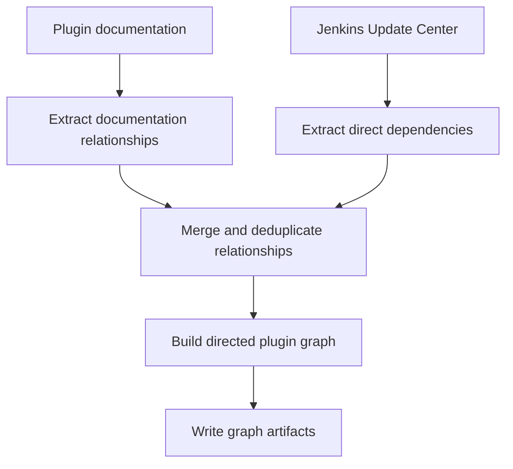
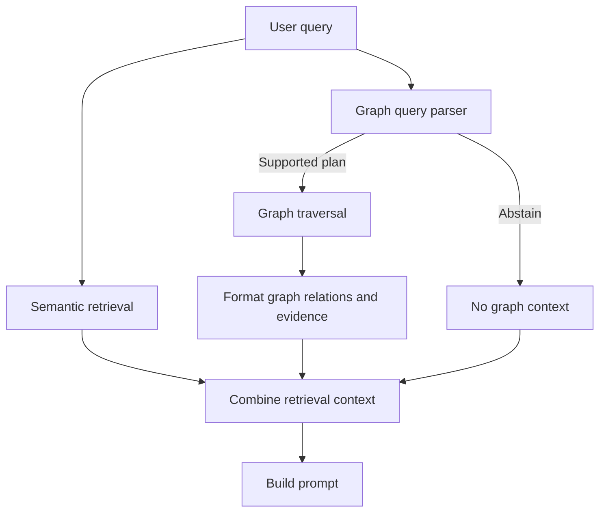

# GraphRAG Plugin Dependency Graph

## 1. What It Is

### Overview

The GraphRAG pipeline builds a directed Jenkins plugin relationship graph and uses it as an additional retrieval source for plugin dependency questions.

The graph extracts relationships from two sources: plugin documentation and the Jenkins Update Center. Documentation chunks provide documented dependency and conflict relationships, while Update Center metadata provides direct required and optional dependency relationships. Each relationship keeps source evidence, so graph results can be appended to the normal retrieved documentation context.

The graph implementation is located under [`chatbot-core/rag/graph/`](../../../chatbot-core/rag/graph/). The FastAPI application loads graph resources when a graph-shaped query needs them and keeps semantic retrieval as the fallback for unsupported or ambiguous questions.

### Why It Is Useful

Semantic retrieval is useful when the answer is described in documentation, but dependency questions also have an explicit structure that is better represented as graph relationships.

Graph retrieval is useful for questions such as:

- What does `git` depend on?
- Which plugins depend on `credentials`?
- Does `workflow-cps` require `workflow-api`?
- Is `cloverphp` compatible with `clover`?

The graph gives the response model both the relationship and the evidence used to build that relationship. It does not replace semantic retrieval or attempt to understand every possible English construction.

### When It Is Used

Graph retrieval is attempted when a query contains:

- A supported dependency or conflict relation phrase.
- At least one Jenkins plugin entity that can be resolved from the canonical plugin lookup.
- A clear entity and relation position that determines the traversal direction.

When these conditions are not met, the graph parser abstains and the existing semantic retrieval path continues normally.

---

## 2. Graph Schema

### Entities

The current graph contains Jenkins plugin nodes. Each node has a canonical plugin ID and an entity type.

| Field | Usage |
| --- | --- |
| `id` | Canonical Jenkins plugin ID used for lookup and traversal. |
| `name` | Display name stored in the graph node. |
| `entity_type` | Graph entity type, currently `Plugin` for the plugin graph. |

Known plugin IDs are loaded from [`plugin_names.json`](../../../chatbot-core/data/raw/plugin_names.json). The graph builder also preserves known plugin nodes that do not currently participate in a relationship.

### Relationships

The plugin graph uses directed relationships from the plugin that declares or has a dependency to the dependency target.

| Relation | Meaning |
| --- | --- |
| `DEPENDS_ON` | Required dependency. |
| `OPTIONAL_DEPENDS_ON` | Optional dependency. |
| `CONFLICTS_WITH` | Plugin conflict or incompatibility relationship. |

For example:

```text
git DEPENDS_ON git-client
plugin-a OPTIONAL_DEPENDS_ON plugin-b
plugin-x CONFLICTS_WITH plugin-y
```

### Evidence

Every graph edge stores evidence fields required by the graph schema:

| Field | Usage |
| --- | --- |
| `source_chunk_id` | Identifies the source chunk or Update Center record. |
| `source_title` | Title associated with the source evidence. |
| `source_data_source` | Identifies the originating data source. |
| `evidence` | Text supporting the relationship. |

Documentation relationships and Update Center relationships are merged into the same graph format. When the same source, relation, and target are available from both sources, the build gives precedence to the Update Center dependency declaration and then applies deterministic deduplication.

---

## 3. Building the Graph

### Inputs

The graph build uses these inputs:

| Input | Purpose |
| --- | --- |
| `data/raw/plugin_names.json` | Canonical plugin IDs used for node preservation and query lookup. |
| `data/processed/chunks_plugin_docs.json` | Plugin documentation chunks used for documentation relation extraction. |
| `data/raw/update-center.actual.json` | Local Jenkins Update Center snapshot containing plugin dependencies. |

The default Update Center endpoint is [updates.jenkins.io/update-center.actual.json](https://updates.jenkins.io/update-center.actual.json). The snapshot is downloaded before a refresh build and replaced atomically only after validation succeeds.

### Build Flow



The build performs the following steps:

1. Load and validate the plugin IDs and plugin documentation chunks.
2. Extract supported relationships from plugin documentation.
3. Load the Update Center plugin map and convert required and optional dependencies into graph triples.
4. Prefer Update Center dependency declarations when a documentation relationship has the same source, relation, and target.
5. Deduplicate the combined triples.
6. Build a NetworkX `MultiDiGraph`.
7. Add known plugin nodes that do not have an edge.
8. Write the graph, triples, and extraction report.

### Generated Artifacts

| Artifact | Purpose |
| --- | --- |
| `data/graph/plugin_graph.json` | Serialized NetworkX plugin graph used at runtime. |
| `data/graph/triples.jsonl` | One serialized graph triple per line, including evidence. |
| `data/graph/extraction_report.json` | Counts for chunks, triples, nodes, edges, and relation types. |

The artifacts are generated outputs. They should be rebuilt from the source inputs rather than edited manually.

---

## 4. Query Planning and Retrieval

### Query Planning

The query parser follows a small position-based model:

```text
1. Normalize mechanical formatting.
2. Resolve all plugin entities and preserve their spans.
3. Find one supported relation phrase.
4. Compare entity positions with the relation position.
5. Build a GraphQueryPlan or abstain.
```

The parser does not try to model general English grammar. It recognizes clear graph-shaped questions and returns `None` for unsupported or ambiguous wording.

### Supported Shapes

| Query shape | Plan direction |
| --- | --- |
| `ENTITY + relation` | `outgoing` |
| `relation + ENTITY` | `incoming` |
| `ENTITY + relation + ENTITY` | `pairwise` |
| Two entities with a conflict relation | `pairwise` |

Examples:

```text
What does git depend on?
source=git, target=unknown, direction=outgoing

Which plugins depend on credentials?
source=unknown, target=credentials, direction=incoming

Does git depend on git-client?
source=git, target=git-client, direction=pairwise
```

The plan carries the relation types, source and target entities, traversal depth, and a diagnostic matched-rule label. It does not contain a separate boolean or count answer mode; graph retrieval returns relationship context for the response model to interpret.

### Retrieval Flow



Graph retrieval uses the parsed plan to select outgoing, incoming, or pairwise edges. A basic `indirect` or `transitive` modifier increases traversal depth for supported queries.

The formatted graph context contains the graph relationship, evidence text, and the source chunk when it is available. This lets the response model combine explicit graph structure with the original plugin documentation.

---

## 5. Runtime Refresh

### Startup Behavior

The FastAPI lifespan calls `refresh_graph_if_stale()` during application startup. The default freshness interval is one day.

If `plugin_graph.json` is newer than the freshness interval, startup logs:

```text
Graph is up to date, no need to refresh.
```

If the artifact is missing or older than the interval, startup downloads the Update Center snapshot and rebuilds the graph before the application finishes startup:

```text
Graph outdated, refreshing.
Graph refresh completed in 10.00s.
```

The refresh is synchronous by design. The API does not report startup completion until graph artifacts are available or the refresh fails and the existing artifacts can be retained.

### Build and Refresh Commands

- `make run-data-graph` builds the graph artifacts from the configured graph inputs.
- `--update-center-path` builds the graph using an existing local Update Center snapshot.
- `--refresh-update-center` fetches the latest Update Center snapshot before rebuilding the graph manually. These options are provided by [`build_graph_artifacts.py`](../../../chatbot-core/rag/graph/build_graph_artifacts.py).

---

## 6. Code Structure

| File | Responsibility |
| --- | --- |
| [`build_graph_artifacts.py`](../../../chatbot-core/rag/graph/build_graph_artifacts.py) | Loads inputs, fetches Update Center data, builds artifacts, and refreshes stale graphs. |
| [`triple_extractor.py`](../../../chatbot-core/rag/graph/triple_extractor.py) | Extracts deterministic plugin relationships from documentation chunks. |
| [`graph_builder.py`](../../../chatbot-core/rag/graph/graph_builder.py) | Converts triples into NetworkX nodes and edges. |
| [`graph_artifacts.py`](../../../chatbot-core/rag/graph/graph_artifacts.py) | Serializes graph artifacts and extraction reports. |
| [`graph_store.py`](../../../chatbot-core/rag/graph/graph_store.py) | Saves and loads the serialized graph. |
| [`query_parser.py`](../../../chatbot-core/rag/graph/query_parser.py) | Resolves query entities and builds position-based graph plans. |
| [`graph_retriever.py`](../../../chatbot-core/rag/graph/graph_retriever.py) | Validates graph artifacts and traverses matching relationships. |
| [`hybrid_context.py`](../../../chatbot-core/rag/graph/hybrid_context.py) | Formats graph relations, evidence, and source chunks for prompts. |
| [`runtime_context.py`](../../../chatbot-core/rag/graph/runtime_context.py) | Loads and caches graph resources for runtime retrieval. |
| [`models.py`](../../../chatbot-core/rag/graph/models.py) | Defines typed graph entities, evidence, relations, and retrieval results. |
| [`schema.py`](../../../chatbot-core/rag/graph/schema.py) | Defines allowed entity, relation, and evidence fields. |

Graph context is integrated at the service and plugin-documentation tool layers. Both paths use the same runtime graph context and formatter.

## 7. Tests and Validation

Graph behavior is covered by focused unit tests under [`chatbot-core/tests/unit/rag/graph/`](../../../chatbot-core/tests/unit/rag/graph/).

The tests cover:

- Graph entity, relation, and evidence validation.
- Documentation triple extraction and deduplication.
- Update Center dependency conversion and snapshot validation.
- Graph artifact writing and loading.
- Query entity resolution and relation-position planning.
- Outgoing, incoming, pairwise, and conflict traversal.
- Required and optional dependency filtering.
- Multi-hop traversal.
- Runtime graph-context formatting and semantic fallback.
- Stale graph refresh behavior.

When investigating a failure, classify it as one of the following before changing the parser or retriever:

1. Input loading or Update Center validation.
2. Entity resolution.
3. Relation extraction.
4. Query-plan construction.
5. Graph traversal.
6. Evidence or prompt-context formatting.
7. Runtime artifact loading or refresh.

---

## 8. Edge Cases Handled

* **Ambiguous wording:** Unsupported relationship shapes fall back to semantic retrieval instead of guessing.
* **Negated queries:** Questions such as `Does git not depend on credentials?` bypass graph traversal.
* **Invalid graph artifacts:** Missing or corrupt artifacts return no graph context instead of failing retrieval.
* **Refresh failures:** Invalid Update Center snapshots do not replace valid existing data.
* **Missing source chunks:** Stored relationship evidence can still be returned when the source chunk is unavailable.

---

## 9. Current Capabilities and Future Improvements

### Current Capabilities

* Supports both outgoing and incoming dependency queries.
* Preserves required and optional dependency types separately.
* Passes relationship evidence and source context to the response model.
* Retains known plugin nodes even when no relationships are extracted.

### Future Improvements

* Use snapshot- or version-aware artifact invalidation.
* Move refresh work out of startup if latency becomes an issue.
* Expose graph freshness and artifact health.
* Support more Jenkins entities and relationship types.
* Improve provenance handling when sources disagree.
* Add an agentic graph-query verifier for parser fallbacks. The verifier would return a structured graph plan, including whether the query is graph-related and its direction, and the result would be validated against known plugin IDs and supported relationships before traversal.
