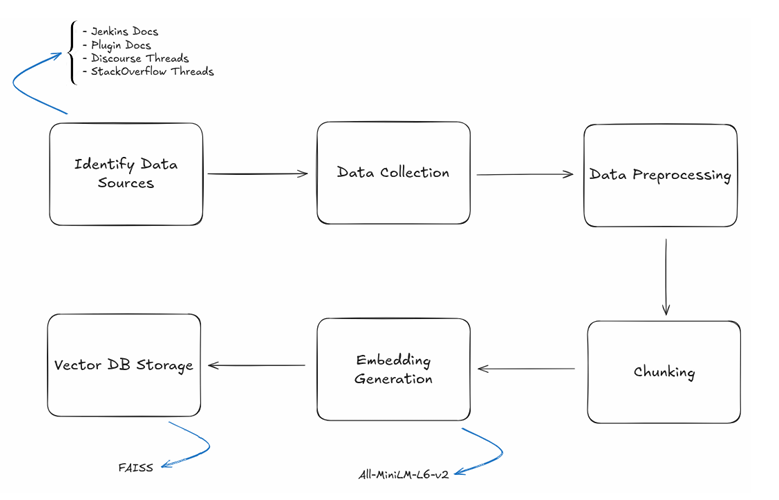
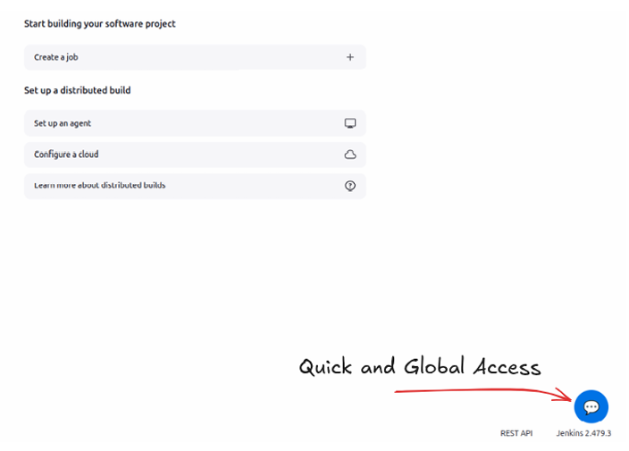

# AI-Powered Chatbot for Quick Access to Jenkins Resources

**Google Summer of Code Program 2025 - Project Final Report**

---

## Project Information

- **Project Repository**: [jenkinsci/resources-ai-chatbot-plugin](https://github.com/jenkinsci/resources-ai-chatbot-plugin)
- **Developer**: Giovanni Vaccarino
- **Email**: giovannivaccarino03@gmail.com
- **GitHub**: [@giovanni-vaccarino](https://github.com/giovanni-vaccarino)

---

## Table of Contents

1. [Project Abstract](#project-abstract)
2. [Project Description](#project-description)
3. [Data Pipeline](#data-pipeline)
4. [API Implementation](#api-implementation)
5. [User Interface](#user-interface)
6. [Testing](#testing)
7. [Agentic Approach](#agentic-approach)
8. [Documentation](#documentation)
9. [Release Process](#release-process)
10. [Project Summary](#project-summary)
11. [Future Work](#future-work)
12. [Final Considerations](#final-considerations)

---

## Project Abstract

Beginners often struggle to navigate Jenkins' documentation and resources effectively. With the advancement of AI technology, this project aims to create a Jenkins plugin that integrates an AI-powered chatbot to reduce the learning curve for newcomers and provide quick, intuitive support for all Jenkins users through a simple user interface.

---

## Project Description

### Introduction

This project focuses on developing a Jenkins plugin that embeds a chatbot powered by a **Retrieval-Augmented Generation (RAG)** architecture. The main goal is to enhance the Jenkins environment by integrating an assistant that can provide contextual and accurate responses based on project documentation, developer discussions, and related resources.

### Report Structure

The report is organized into several key chapters, each highlighting a major stage of the work:

- **Data Pipeline**: The foundation of the chatbot, responsible for preparing source data, splitting it into meaningful chunks, generating embeddings, and storing them in a vector database. This enables semantic search over stored knowledge, ensuring the chatbot grounds its answers in relevant context.

- **API Implementation**: The design and implementation of an API layer that handles user queries, interacts with the retriever, and returns responses.

- **User Interface**: A user-friendly UI developed within Jenkins to provide seamless access to the chatbot, designed to be intuitive and responsive.

- **Testing**: A thorough testing phase ensuring the correctness and reliability of the chatbot across all components.

- **Agentic Approach and Hybrid Search**: Beyond the classical RAG pipeline, an agentic approach was introduced to handle complex user queries better. This extends the chatbot's capabilities by enabling tool usage and integrating a hybrid search strategy that combines semantic and keyword-based retrieval.

- **Documentation**: Comprehensive documentation supporting both users and contributors, including usage guides, development instructions, and design rationales.

- **Release Process**: Details on how the plugin was packaged, versioned, and prepared for deployment.

---

## Data Pipeline

The data pipeline forms the backbone of the chatbot, collecting relevant Jenkins-related resources, cleaning and normalizing the content, transforming it into machine-readable form, and storing it for efficient semantic search.

### Source Identification

Four categories of resources were selected as the most valuable information sources:

1. **Official Jenkins Documentation**: The primary reference for Jenkins features and architecture
   - URL: https://www.jenkins.io/doc/

2. **Plugin Documentation**: Essential for information about the Jenkins plugin ecosystem
   - URL: https://plugins.jenkins.io/

3. **Community Discussions on Discourse**: A rich source of troubleshooting knowledge and best practices
   - URL: https://community.jenkins.io/t/welcome-to-discourse/7

4. **Stack Overflow Threads**: Widely used by developers for problem-solving, containing concrete issues and solutions

### Data Collection

Each data source required a tailored collection strategy:

#### Jenkins Documentation
Instead of relying on the GitHub repository of jenkins.io, a web crawler was used. This approach makes it easier to automate future updates and ensures the extracted content reflects the published website structure.

#### Plugin Documentation
A two-step approach was implemented:
1. Fetch the list of official plugin names
2. Use a crawler to retrieve corresponding documentation pages for each plugin

#### Discourse Threads
The Discourse API was leveraged to fetch relevant topics directly, taking advantage of structured endpoints to collect discussions efficiently.

#### Stack Overflow Threads
Queries were executed through the StackExchange Data Explorer, allowing precise filtering of Jenkins-related discussions and focusing on high-quality threads. The specific query used can be found in the repository's collection markdown file.

**Related PR**: [#1](https://github.com/jenkinsci/resources-ai-chatbot-plugin/pull/1)

### Data Preprocessing

Raw data from different sources required careful cleaning and filtering:

#### Jenkins Documentation
- Pages were parsed to extract only main content while discarding navigation menus, scripts, images, table of contents blocks, and HTML comments
- Filtering removed low-value entries: pages with fewer than 300 visible characters or excessive link-to-text ratios
- This eliminated placeholders and index-like pages while retaining important documentation

#### Plugin Documentation
- Preprocessing removed unnecessary HTML elements and boilerplate content
- Filtered out trivial descriptions with fewer than 60 characters
- Ensured only meaningful plugin content was passed forward

#### Discourse Threads
Cleaning was largely handled during collection, as the API already provided structured discussions.

#### Stack Overflow Threads
Threads were pre-filtered during collection to include only Jenkins-related questions with positively scored, accepted answers. No additional preprocessing was required.

**Related PR**: [#3](https://github.com/jenkinsci/resources-ai-chatbot-plugin/pull/3)

### Chunking

To enable efficient semantic search, large documents and threads were divided into manageable chunks following these principles:

- Preserve semantic coherence, avoiding mid-sentence splits
- Leverage HTML structure (headings, lists) where possible
- Apply sliding windows to retain context overlap between adjacent chunks

**Implementation**: LangChain's Text Splitter was used for quick implementation of the splitting logic.

**Related PR**: [#6](https://github.com/jenkinsci/resources-ai-chatbot-plugin/pull/6)

### Embedding

After chunking, text chunks are converted into numerical vectors for semantic similarity search.

#### Why Embeddings?
Embeddings capture semantic meaning, allowing the retriever to find relevant passages even when the query doesn't use the exact same words as the source material.

#### Implementation
- Each chunk was passed through an embedding model that outputs fixed-length vectors
- **Model Used**: `all-minilm-l6-v2`, a sentence transformer model chosen to balance accuracy and computational cost

**Related PR**: [#9](https://github.com/jenkinsci/resources-ai-chatbot-plugin/pull/9)

### Vector Storage

The final step involves storing embeddings in a vector database, which serves as the backbone of the retriever.

#### Implementation Details
- **Database**: FAISS (Facebook AI Similarity Search)
- **Unified Index**: All chunks from different sources (official docs, plugins, Discourse, Stack Overflow) are stored together
- **Benefits**: Allows queries to seamlessly retrieve information across different sources

At this stage, the retriever relies solely on semantic similarity. Later sections introduce hybrid search techniques combining semantic embeddings with keyword-based approaches for improved retrieval accuracy.

**Related PR**: [#9](https://github.com/jenkinsci/resources-ai-chatbot-plugin/pull/9)

---

## API Implementation

The API serves as the central interface exposing the chatbot's functionality as a service. Its primary scope is to provide endpoints that manage chat sessions and deliver chatbot responses.

**Related PR**: [#10](https://github.com/jenkinsci/resources-ai-chatbot-plugin/pull/10)

### Tech Stack

#### FastAPI
A modern Python web framework chosen for:
- High performance
- Ease of use
- Automatic OpenAPI documentation
- Strong typing through Pydantic models

#### Uvicorn
An ASGI server optimized for:
- Fast responses
- Efficient handling of concurrent requests

#### llama.cpp Integration
For underlying model execution, the API integrates with the llama.cpp library, enabling:
- Efficient inference of large language models on local hardware
- Experimentation without relying on external APIs
- Offline functionality

### Extensible Architecture

The API follows a clean separation of concerns with a modular design:

- **Controller Layer** (`api/routes/`): Handles FastAPI routes, request validation, and HTTP status codes

- **Service Layer** (`api/services/`): Encapsulates chatbot logic, including conversation memory, retrieval, and response generation

- **Model/Schema Definitions** (`api/models/`): Defines Pydantic classes and the abstract LLM provider interface

- **Prompt Builder** (`api/prompts/`): Ensures structured and consistent prompts across different queries

- **Configuration** (`api/config/`): Manages environment settings and API parameters

### LLM Abstraction

The API introduces an `LLMProvider` abstraction layer to decouple chatbot logic from the underlying model.

#### Current Implementation
- **Model**: Mistral 7B Instruct (v0.2, GGUF Q4_K_M)
- **Runtime**: Local execution via llama.cpp
- **Benefits**: Good balance between performance and quality for local development

#### Future Extensibility
The abstraction allows easy integration of alternative providers:
- OpenAI models via API
- Gemini models via API
- Other hosted LLM services

This design ensures users with limited compute resources can opt for hosted LLMs, while others can run models locally for offline functionality.

### Available Endpoints

The API exposes three main endpoints:

1. **`POST /api/chatbot/sessions`**
   Creates a new chat session and returns a `session_id`

2. **`POST /api/chatbot/sessions/{session_id}/message`**
   Sends a message to the chatbot and returns its reply

3. **`DELETE /api/chatbot/sessions/{session_id}`**
   Deletes an existing session

These endpoints provide a minimal but sufficient interface for managing conversations, with potential for expansion (e.g., session persistence, advanced configuration).

### Session Memory Management

Conversation context is maintained using **LangChain's ConversationBufferMemory**:
- Stored in a dictionary keyed by `session_id`
- Allows each session to preserve chat history
- Ensures coherent and context-aware responses
- Currently managed in-memory

---

## User Interface

The user interface was designed to integrate seamlessly into the Jenkins environment. Delivered as part of the plugin, the UI allows developers and operators to interact directly with the chatbot from within Jenkins without relying on external applications.

**Related PRs**: [#7](https://github.com/jenkinsci/resources-ai-chatbot-plugin/pull/7), [#13](https://github.com/jenkinsci/resources-ai-chatbot-plugin/pull/13)

### Tech Stack

#### Framework: React
Chosen for:
- Component-based architecture
- Flexibility
- Strong community support

#### Language: TypeScript
Provides:
- Better type safety
- Improved maintainability for growing codebase

#### Build Tool: Vite
Enables:
- Fast development builds
- Optimized production bundles

These technologies balance performance, maintainability, and developer experience. The resulting frontend is bundled and served as part of the Jenkins plugin, ensuring a smooth installation process.

### UI Integration in Jenkins

The plugin uses a **global decorator extension** to make the chatbot accessible across the Jenkins interface. This injects the chatbot panel into every page of Jenkins, allowing users to interact with the assistant regardless of their location in the interface.

#### Access Point
A button located in the **bottom-right corner** of the Jenkins UI provides access to the chatbot. This placement ensures:
- Minimal disruption to existing workflows
- Ready availability of the assistant

### User Experience

The chatbot UI is designed to be simple and intuitive:

- **Input Field**: Users can type or paste questions into a text box supporting both single-line and multi-line input

- **Clear Chat Button**: Located in the header, resets the conversation

- **Session Persistence**: Sessions persist during page refresh, maintaining continuity within the same browser tab

This design mirrors familiar chat interfaces, reducing the learning curve and making the chatbot feel natural to use.

### Preview

---

## Testing

Testing played a central role in the development of this project. Given the chatbot's integration of multiple components—from data processing to API endpoints and frontend interactions—ensuring correctness, stability, and maintainability was crucial throughout the development cycle.

Testing has been integrated into the project's **Continuous Integration (CI)** pipeline, continuously verifying that new changes don't break existing functionality.

**Related PRs**: [#14](https://github.com/jenkinsci/resources-ai-chatbot-plugin/pull/14), [#17](https://github.com/jenkinsci/resources-ai-chatbot-plugin/pull/17), [#18](https://github.com/jenkinsci/resources-ai-chatbot-plugin/pull/18), [#21](https://github.com/jenkinsci/resources-ai-chatbot-plugin/pull/21), [#22](https://github.com/jenkinsci/resources-ai-chatbot-plugin/pull/22), [#23](https://github.com/jenkinsci/resources-ai-chatbot-plugin/pull/23)

### Backend Testing

Backend testing was implemented using **pytest**, a widely adopted testing framework for Python.

#### Unit Tests
Covered individual modules including:
- Data preprocessing utilities
- API services
- Memory management

**Approach**: Extensive use of mocks to focus on specific function purposes

#### Integration Tests
Ensured the full request-response cycle functioned correctly, validating interactions between:
- API
- Retriever
- Language model

**Approach**: Only the generation function was mocked, allowing testing of real component interactions

### Frontend Testing

Frontend testing was carried out using **Jest** and **React Testing Library**.

#### Unit Tests
Validated isolated components such as:
- Buttons
- Input fields
- Chat messages

This approach ensured the user interface behaved as intended across different scenarios and that UI updates didn't disrupt existing features.

### Static Analysis

Static analysis tools were introduced to maintain a consistent and clean codebase.

#### Implementation
- Linters and formatters configured for both Python and TypeScript code
- Enforces style conventions
- Catches common programming mistakes
- Improves overall readability

#### Benefits
- Ensures the project remains accessible to future contributors
- Aligns with best practices

---

## Agentic Approach

### Motivation

Once the baseline RAG-based prototype was complete and product-ready, the next step was to improve the quality and adaptability of responses. A classical RAG pipeline relies on a fixed retriever and single vector store, which can limit flexibility when dealing with diverse query types.

To address this, the project evolved into an **agentic architecture**, where the language model is empowered to dynamically select the most suitable retrieval strategy and tools depending on the query.

### Multi-tool Architecture

Instead of aggregating all data sources into a single vector database, the new design introduces:

- **Separate vector databases per data source**:
  - Jenkins documentation
  - Plugin documentation
  - Discourse threads
  - Stack Overflow discussions

- **Dedicated search tools** for each source

- **LLM as an agent**: Chooses which tool to call and with what parameters

#### Benefits
This modular approach ensures queries are routed to the most relevant context while still allowing the system to combine information across sources when needed.

### Hybrid Retrieval

To further improve retrieval quality, each search tool implements a hybrid strategy:

1. **Semantic Search**: Powered by vector similarity between embeddings

2. **Keyword-based Search**: Implemented using the BM25 algorithm, integrated through the **retriv** library

The combination of these methods ensures both semantic relevance and lexical precision, allowing the chatbot to handle:
- Natural language queries
- Technical keyword-heavy queries (e.g., configuration parameters, plugin names)

### Query Handling Flow

The following diagram illustrates how queries are processed under this agentic approach:

#### Processing Steps

1. **Query Classification**
   The agent first classifies whether the query is simple or multi-part

2. **Tool Selection**
   For simple queries, the retriever agent selects appropriate search tools (e.g., plugin docs, core docs, or threads)

3. **Context Retrieval**
   The selected tool(s) performs both semantic and keyword-based retrieval, and results are combined

4. **Relevance Check**
   Retrieved content is evaluated:
   - **If highly relevant** → Passed directly to response generation
   - **If low relevance** → System avoids hallucination and responds with a fallback message

5. **Multi-Question Queries**
   If the original query contains multiple sub-questions:
   - Agent splits them
   - Processes each separately using the above steps
   - Assembles a final combined response

**Related PRs**: [#35](https://github.com/jenkinsci/resources-ai-chatbot-plugin/pull/35), [#38](https://github.com/jenkinsci/resources-ai-chatbot-plugin/pull/38), [#39](https://github.com/jenkinsci/resources-ai-chatbot-plugin/pull/39), [#40](https://github.com/jenkinsci/resources-ai-chatbot-plugin/pull/40)

---

## Documentation

Proper documentation was a key aspect of the project to ensure clarity, reproducibility, and maintainability. All project-related documentation is stored under the `docs/` directory in the repository.

### Documentation Structure

The documentation structure mirrors the organization of the codebase, with multiple Markdown (`.md`) files explaining:

- **Scripts and their purpose**
- **Reasoning behind each process**
- **Design decisions and their context**

### Key Documentation Sections

#### Data Collection
Details how different sources are gathered:
- Official documentation
- Plugin pages
- Community discussions
- Why each approach was chosen

#### Other Sections
Additional documentation covers:
- Preprocessing
- Chunking and embedding
- API layer
- Frontend/UI
- Testing strategy

### Developer Tools

A **Makefile** has been created to provide ready-to-run scripts for common operations:
- Running the API
- Executing the data pipeline procedure
- Other important development tasks

### Documentation Philosophy

The documentation not only describes what the code does but also provides context for design decisions, ensuring future contributors can easily extend and adapt the project.

**Related PRs**: [#25](https://github.com/jenkinsci/resources-ai-chatbot-plugin/pull/25), [#28](https://github.com/jenkinsci/resources-ai-chatbot-plugin/pull/28)

---

## Release Process

To make the chatbot plugin available to the Jenkins community, a release process was carried out following the official Jenkins publishing guidelines. This ensured the plugin could be distributed through the official Jenkins Artifactory and installed directly by users from within their Jenkins instance.

### Process Documentation

The process followed the documentation provided by Jenkins:
- **URL**: https://www.jenkins.io/doc/developer/publishing/releasing-cd/

### Distribution

The plugin is now:
- Available through the official Jenkins Artifactory
- Installable directly from within Jenkins instances
- Accessible to the entire Jenkins community

**Related PRs**: [#41](https://github.com/jenkinsci/resources-ai-chatbot-plugin/pull/41), [#42](https://github.com/jenkinsci/resources-ai-chatbot-plugin/pull/42)

---

## Project Summary

### What Was Accomplished

Over the course of the project, the following was achieved:

1. **Data Pipeline**
   Built a comprehensive pipeline to collect, clean, chunk, and embed Jenkins-related resources

2. **Retriever System**
   Developed a retriever backed by FAISS for semantic and hybrid search capabilities

3. **API Backend**
   Implemented a FastAPI backend with modular architecture and LLM abstraction

4. **User Interface**
   Created a React UI integrated directly into the Jenkins environment

5. **Testing Infrastructure**
   Added comprehensive testing:
   - Backend with pytest
   - Frontend with Jest/React Testing Library
   - Static analysis tools

6. **Documentation**
   Produced user and developer documentation

7. **Release**
   Completed the release process for community distribution

### Current State

The plugin is now:
- **Fully functional** and available for use within Jenkins
- **Tested** and documented
- **Released** and available to the community

While the core objectives have been achieved, further improvements and features are outlined in the Future Work section.

---

## Future Work

The 12 weeks of work resulted in a deployed plugin that delivers the core functionalities as expected. However, several items remain for future development:

### Planned but Not Completed

During the second half of the coding period, the following were planned but not completed:

1. **WebSocket Connection**
   Implement a WebSocket connection to provide a more responsive, real-time user experience

2. **Comprehensive Evaluation**
   Carry out evaluation of the chatbot using an LLM-as-a-judge approach to understand overall system behavior

### Additional Enhancements

Several issues were opened throughout the coding period, including:

- **Feature Proposals**:
  - Allow users to attach images or PDFs to the chatbot
  - Other capability extensions

- **Smaller Improvements**:
  - Various quality-of-life enhancements
  - Performance optimizations

All open issues can be found in the [project repository](https://github.com/jenkinsci/resources-ai-chatbot-plugin/issues).

---

